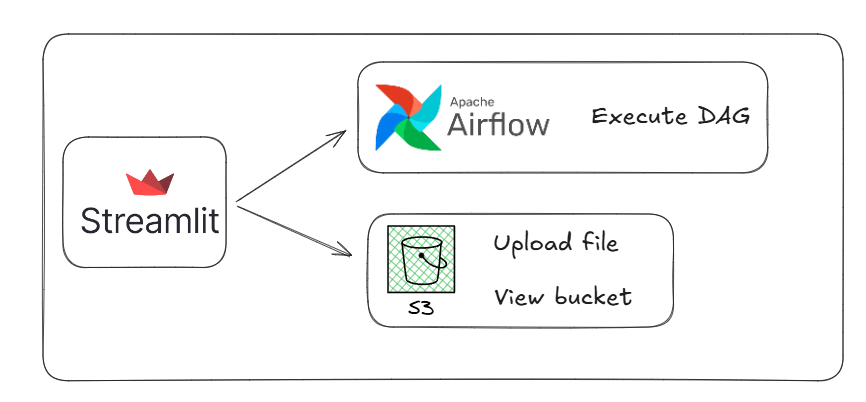
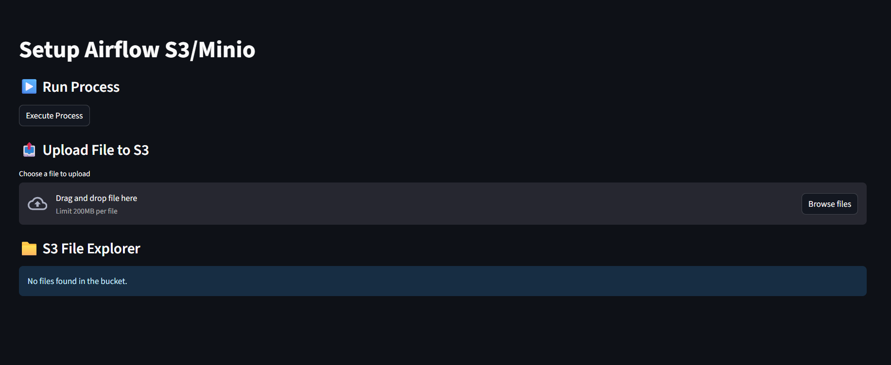

# Streamlit Front end for Airflow and S3 Bucket (MinIO)
This project uses Streamlit as a frontend interface to trigger Apache Airflow DAGs and browse files stored in an S3-compatible bucket, using MinIO as the storage backend.

## 📺 YouTube Video
Link: 

## Architecture


## Prerequisites
- Git
- Docker
- Docker Compose
- Python 3.7+ (recommended)


## Tools Overview
### Apache Airflow
Apache Airflow is an open-source workflow orchestration platform that allows you to programmatically author, schedule, and monitor workflows as directed acyclic graphs (DAGs) of tasks.

### Docker
Docker is a containerization platform that packages applications and their dependencies into isolated containers to run anywhere.

### MinIO / S3
MinIO is a high-performance, S3-compatible object storage server. It supports the Amazon S3 API, enabling use of existing S3 tools and SDKs.

## How to Install Docker?
You can follow this tutorial: 

https://www.youtube.com/watch?v=pRFzDVn40rw&list=PLbPvnlmz6e_L_3Zw_fGtMcMY0eAOZnN-H

## How to Use the Project?
Clone the repository:
```
git clone https://github.com/wlcamargo/setup_streamlit_airflow_s3minio.git
```
```
cd setup_streamlit_airflow_s3minio
```

Start the Airflow container:
```
cd applications/airflow
docker compose up -d
```

### How to Access Airflow?
Open your browser and go to:

http://localhost:8081

Airflow Credentials  
| Username | Password |  
| -------- | -------- |  
| airflow  | airflow  |

Start the Minio container:
```
cd applications/minio
docker compose up -d
```

### How to Access Minio?
Open your browser and go to:

http://localhost:9000

Minio Credentials  
| Username  | Password    |  
| --------- | ----------- |  
| chapolin  | mudar@123   |

### How to run front end?

#### Create a Virtual Environment

##### On Linux/macOS:

```bash 
python3 -m venv venv
```
##### On Windows:

```bash Windows
python -m venv venv
```

#### Activate the Virtual Environment

##### On Linux/macOS:

```bash
source venv/bin/activate
```

##### On Windows:

```bash
venv\Scripts\activate
```

#### Install Python Dependencies

```bash
pip install -r requirements.txt
```

#### Execute the command to start application
```
cd applications/frontend  
streamlit run app.py
```

Open your browser and go to:

http://localhost:8501

App layout:



## Connection Airflow S3

⚠️ This step is important to integrate Airflow with S3.

Open the Airflow interface, click on Admin, then Connections, and select Amazon Web Services.

Add your secrets and the configuration below:
```
{
  "aws_access_key_id": "chapolin",
  "aws_secret_access_key": "mudar@123",
  "host": "http://host.docker.internal:9000",
  "region_name": "us-east-1"
}
```

## Conclusion
If you reached this point, congratulations! You now have an example project to run Airflow processes and view files in an S3 bucket using Streamlit as the frontend.

## 📚 References
- [Streamlit docs](https://docs.streamlit.io)  
- [Airflow docs](https://airflow.apache.org/docs/)  
- [MinIO docs](https://min.io/docs/)  
- [AWS S3 docs](https://docs.aws.amazon.com/s3/index.html)

## 🧑🏼‍🚀 Developer
| Developer      | LinkedIn   | Email               | Portfolio   |  
| -------------- | ---------- | ------------------- | ----------- |  
| Wallace Camargo | LinkedIn   | wallacecpdg@gmail.com | Portfolio   |  
